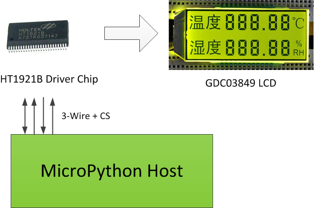

[:cn:简体中文][CN]

3Wire-HT1621B-GDC03849
====

> The 3Wire-HT1621B-GDC03849 is the GDC03849 LCD driver module for the ht1621b as the driver chip. The driver chip and the main CPU exchange data for the 3+CS bus communication mode.


HT1621B
----
> The HT1621 is a 128-point memory image and multi-function LCD driver manufactured by [HOLTEK][HT]. The software configuration features of the HT1621 make it suitable for a variety of LCD applications including LCD modules and display subsystems. There are only 4 or 5 pins for connecting the main controller to the HT1621. The HT1621 also has a power-saving command to reduce system power consumption. Please read the [HT1621B Data Sheet][1] for details.


#### API

* **init(_timer = CMD_TIMER_DIS, _wdt = CMD_WDT_DIS, _scs = CMD_RC256K, _bias = CMD_B3C4, _tone = CMD_TONE4K, _irq = CMD_IRQ_DIS, _twc = CMD_F128, _mod = CMD_NORMAL)**</BR>
  *Chip function and parameter initialization.*
  _timer: Time base output settings</BR>
  _wdt: WDT Set</BR>
  _scs: System clock source setting</BR>
  _bias: Bias and Com settings</BR>
  _tone: Sound settings</BR>
  _irq: IRQ Set</BR>
  _twc: Time base/WDT clock output setting（F1～F128）</BR>
  _mod: Mode setting (test mode and normal mode)</BR>
  
* **HT1621xWrCmd(_cmd)**</BR>
  *Send one Command。*</BR>
  _cmd: Command（Hex）</BR>
  ```python
  # Send an command to turn on the LCD bias voltage (ie turn on the LCD power) to ht1621b
  HT1621xWrCmd(0x006)    # A constant (LCDON) has been set here instead of the command value (0x006).
  ```
* **HT1621xWrOneData(_addr, _htdata)**</BR>
  *The specified address sends a single data.*</BR>
  _addr: Address（Hex）</BR>
  _htdata:Data,1 byte.（Hex）</BR>
  ```python
  # Display the number on the far left (1st digit) of the temperature as 2
  HT1621xWrOneData(0x13, ((0x0B, 0x06)))
  ```
  
* **HT1621xWrAllData(_addr, _htdata)**</BR>
  *Specify the starting address to send multiple data in succession.*</BR>
  _addr：starting address(Hex)</BR>
  _htdata：Continuous data(Hex)</BR>
  ```python
  # The temperature value area is all shown as 2.
  ALLSHOW(0x00, ((0x0B, 0x06), (0x0B, 0x06), (0x0B, 0x06), (0x0B, 0x06), (0x0B, 0x06), (0x0B, 0x06)))
  ```

* **ALLSHOW(_addr, _nbit)**</BR>
  *Specify the starting address to continuously send the specified number of 1.*</BR>
  _addr:starting address(Hex)</BR>
  _nbit:Number of data(1-32)</BR>
  ```python
  # All display memory content, i.e., all 1 is set.
  ALLSHOW(0x00, 32)
  ```

* **ALLCLEAR(_addr, _nbit)**</BR>
  *Specify the starting address to continuously send the specified number of 0.*</BR>
  _addr: starting address(Hex)</BR>
  _nbit: Number of data(1-32)</BR>
  ```python
  # Clear all the contents of the memory, that is, set all to 0.
  ALLCLEAR(0x00, 32)
  ```
* **LCDON()**</BR>
  *Turn on the LCD bias generator*
  
* **LCDOFF()** </BR>
  *Turn off the LCD bias generator.*  

* **HTBEEP(_t)**</BR>
  *Make the buzzer sound for the specified time.*</BR>
  _t:Hold time, in milliseconds.</BR>
  ```python
  # The buzzer continues to sound for 500 milliseconds.
  HTBEEP(500)
  ```
 
#### CONSTANT
 
* Function symbol(Flag)

  Name | Description
  --- | ---
  FLAG_CMD | command
  FLAG_READ | Read only RAM
  FLAG_WRITE | Write only RAM
  FLAG_MODIFY | write and read RAM(即修改RAM)READ-MODIFY-WRITE

* LCD control

  Name | Description
  --- | ---
  CMD_LCDON | Turn on the LCD bias generator
  CMD_LCDOFF | Turn off the LCD bias generator (default setting at power-on)

* SYS control

  Name | Description
  --- | ---
  CMD_SYSEN | Turn on the system oscillator
  CMD_SYSDIS | Turn off the system and the LCD bias generator oscillator (default at power)

* Bias and COM settings, namely the bias voltage and COM terminal, the current parameters are selected according to the liquid crystal data file, such as 1/4DUTY, 1/3BIAL, then select "B3C4".
  * 1/2 bias setting

    Name | Description
    --- | ---
    CMD_B2C2 | 2COM,1/2 bias
    CMD_B2C3 | 001001000 3COM,1/2 bias
    CMD_B2C4 | 4COM,1/2 bias

  * 1/3 bias setting

    Name | Description
    --- | ---
    CMD_B3C2 | 2COM,1/3 bias
    CMD_B3C3 | 3COM,1/3 bias
    CMD_B3C4 | 4COM,1/3 bias

* Clock setting

  Name | Description
  --- | ---
  CMD_RC256K | The system clock source chip RC oscillator (default at power)
  CMD_EXT256K | System clock source, external clock
  CMD_XTAL32K | System clock source (crystal oscillator)

* Time base setting

  Name | Description
  --- | ---
  CMD_TIMER_EN | Time base output enable
  CMD_TIMER_DIS | Time base output failure
  CMD_CLR_TIMER | Time base generator clear

* WDT Set

  Name | Description
  --- | ---
  CMD_WDT_DIS | WDT overflow flag output is invalid, disable watchdog
  CMD_WDT_EN | WDT overflow flag output is valid, enable watchdog
  CMD_CLR_WDT | Clear WDT status

* Sound output setting

  Name | Description
  --- | ---
  CMD_TONE2K | Set the sound frequency output to 2KHz
  CMD_TONE4K | Set the sound frequency output to 4KHz
  CMD_TONEON | Turn on the sound output
  CMD_TONEOFF | Turn off the sound output (default setting at power-on)

* Time base / WDT output settings

  Name | Description
  --- | ---
  CMD_F1 | Time base / WDT clock output: 1Hz</BR> WDT timeout flag: 4s
  CMD_F2 | Time base / WDT clock output: 2Hz</BR> WDT timeout flag: 2s
  CMD_F4 | Time base / WDT clock output: 4Hz</BR> WDT timeout flag: 1s
  CMD_F8 | Time base / WDT clock output: 8Hz</BR> WDT timeout flag: 1/2s
  CMD_F16 | Time base / WDT clock output: 16Hz</BR> WDT timeout flag: 1/4s
  CMD_F32 | Time base / WDT clock output: 32Hz</BR> WDT timeout flag: 1/8s
  CMD_F64 | Time base / WDT clock output: 64Hz</BR> WDT timeout flag: 1/16s
  CMD_F128 | Time base / WDT clock output: 128Hz</BR> WDT timeout flag: 1/32s (default setting at power-on)

* IRQ Set

  Name | Description
  --- | ---
  CMD_IRQ_DIS | Disable IRQ output (default setting at power-on)
  CMD_IRQ_EN | Make the IRQ output valid

* Work modle set

  Name | Description
  --- | ---
  CMD_TEST | Test mode
  CMD_NORMAL | Normal mode (default setting at power-on)

</BR></BR>


GDC03849
----
> GDC03849 is a liquid crystal screen produced by [Good-Display][DL], which is only used to display the temperature and temperature values of 3-digit integers and 2-digit decimals. For details, please read [GDC03849 Data Sheet][2].

#### API

* **viewTemp(_gdcdata)**</BR>
  *Display temperature value in temperature display area*</BR>
  _gdcdata: Temperature value (floating point number)</BR>
  ```python
  # Display temperature value 25.34。
  viewTemp(25.34)
  ```
  
* **viewRH(_gdcdata)**</BR>
  *Display humidity value in the humidity display area*</BR>
  _gdcdata: Humidity value (floating point number)</BR>
  ```python
  # Display humidity value 93.43。
  viewRH(93.45)
  ```

* **LCDALLSHOW()**</BR>
  *Display all fields of the entire LCD*</BR>

* **LCDALLCLEAR()**</BR>
  *Clear all fields of the LCD display*</BR>

* **TEMPCLEAR()**</BR>
  *Clear temperature area (full line) all fields display*</BR>
  
* **RHCLEAR()**</BR>
  *Clear humidity area (full line) all fields display*</BR>

#### CONSTANT

Name | Description
--- | ---
NUMCODE_RH_HEX | Segment code encoding of a single character in the humidity zone stored in tuple mode (hex)
NUMCODE_TEMP_HEX | Segment code encoding of a single character in a temperature zone stored in tuple mode (hex)


#### Comprehensive example

* Display temperature zone: temperature 33.05 degrees Celsius, humidity 98.34%

```python
# The board:PYB Nano
from ht1621x import HT1621B
from gdc03849 import GDC03849

from machine import Pin

CS = Pin("A0")
RD = Pin("A1")
WR = Pin("B0")
DA = Pin("B1")

ht  = HT1621B(CS, RD, WR, DA)
gdc = GDC03849(ht)

gdc.viewTemp(33.05)
gdc.viewRH(98.34)

```


[HT]:http://www.holtek.com.cn
[DL]:http://www.good-display.cn
[1]:./DataSheet/HT1621EN.pdf
[2]:./DataSheet/GDC03849C1P6.8.pdf
[CN]:./README_CN.md
