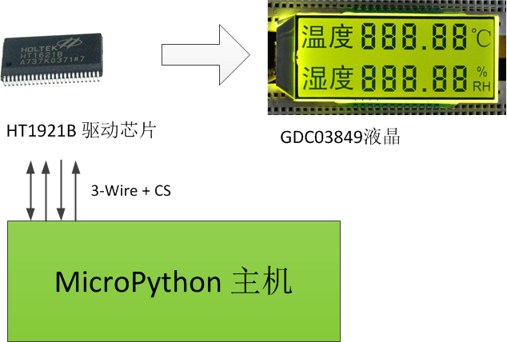

[:uk:English][EN]

3Wire-HT1621B-GDC03849
====

> 3Wire-HT1621B-GDC03849 为ht1621b作为驱动芯片的GDC03849液晶驱动模块。驱动芯片与主CPU为3+CS总线通讯方式进行数据交换。


HT1621B
----
> HT1621是由[台湾合泰半导体公司][HT]生产的一款128点内存映象和多功能的LCD驱动器，HT1621 的软件配置特性使它适用于多种LCD应用场合包括LCD模块和显示子系统用于连接主控制器和HT1621的管脚只有4或5条，HT1621 还有一个节电命令用于降低系统功耗。详细资料请阅读 [HT1621B数据手册][1]


#### 接口

* **init(_timer = CMD_TIMER_DIS, _wdt = CMD_WDT_DIS, _scs = CMD_RC256K, _bias = CMD_B3C4, _tone = CMD_TONE4K, _irq = CMD_IRQ_DIS, _twc = CMD_F128, _mod = CMD_NORMAL)**</BR>
  *芯片功能与参数初始化*
  _timer: 时基输出设置</BR>
  _wdt: WDT溢出标志输出设置</BR>
  _scs: 系统时钟源设置</BR>
  _bias: 偏压和公共端设置</BR>
  _tone: 声音设置</BR>
  _irq: IRQ设置（生效/失效）</BR>
  _twc: 时基/WDT时钟输出设置（F1～F128）</BR>
  _mod: 模式设置（测试模式和普通模式）</BR>

* **HT1621xWrCmd(_cmd)**</BR>
  *发送单个命令。*</BR>
  _cmd: 命令。（16进制）</BR>
  ```python
  # 向ht1621b发送打开LCD偏置电压（即打开LCD电源）的命令
  HT1621xWrCmd(0x006)    # 在这里已经设置了常量（LCDON）来代替命令值（0x006)。
  ```
* **HT1621xWrOneData(_addr, _htdata)**</BR>
  *指定地址发送单个数据。*</BR>
  _addr: 地址（16进制）</BR>
  _htdata:数据，通常为1个字节。（16进制）</BR>
  ```python
  # 将温度最左侧(1号位)的数字显示为2
  HT1621xWrOneData(0x13, ((0x0B, 0x06)))
  ```
  
* **HT1621xWrAllData(_addr, _htdata)**</BR>
  *指定起始地址，连续发送多个数据。*</BR>
  _addr：起始地址（16进制）</BR>
  _htdata：连续的数据（16进制列表）</BR>
  ```python
  # 将温度值区全部显示为2。
  ALLSHOW(0x00, ((0x0B, 0x06), (0x0B, 0x06), (0x0B, 0x06), (0x0B, 0x06), (0x0B, 0x06), (0x0B, 0x06)))
  ```

* **ALLSHOW(_addr, _nbit)**</BR>
  *指定起始地址连续发送指定个数的 1。*</BR>
  _addr:起始地址（16进制）</BR>
  _nbit:数据SEG位数(1-32)。</BR>
  ```python
  # 清除内存中所有内容，即全部置1
  ALLSHOW(0x00, 32)
  ```

* **ALLCLEAR(_addr, _nbit)**</BR>
  *指定起始地址连续发送指定个数的 0。*</BR>
  _addr: 起始地址。（0x00-0x)</BR>
  _nbit: RAM区（SEG）个数（1-32）。</BR>
  ```python
  # 清除内存中所有内容，即全部置0
  ALLCLEAR(0x00, 32)
  ```
* **LCDON()**</BR>
  *打开LCD偏压发生器。*
  
* **LCDOFF()** </BR>
  *关闭LCD偏压发生器。*  

* **HTBEEP(_t)**</BR>
  *使蜂鸣器一直响指定的时间后不响。*</BR>
  _t:保持时间，单位：毫秒</BR>
  ```python
  # 蜂鸣器持续响500毫秒
  HTBEEP(500)
  ```
 
#### 常量
 
* 功能符号(标志字)

  名称 | 描述
  --- | ---
  FLAG_CMD | 命令
  FLAG_READ | 只读RAM
  FLAG_WRITE | 只写RAM
  FLAG_MODIFY | 读和写RAM(即修改RAM)READ-MODIFY-WRITE

* 液晶控制

  名称 | 描述
  --- | ---
  CMD_LCDON | 打开LCD偏压发生器
  CMD_LCDOFF | 关闭LCD偏压发生器（上电时默认设置）

* 系统控制

  名称 | 描述
  --- | ---
  CMD_SYSEN | 打开系统振荡器
  CMD_SYSDIS | 关半系统振荡器和LCD偏压发生器 （上电时默认设置）

* Bias与COM设置，即偏置电压与COM端,当前参数根据液晶的资料文件进行选择，比如1/4DUTY,1/3BIAL，则选择"B3C4"
  * 1/2偏压设置

    名称 | 描述
    --- | ---
    CMD_B2C2 | 2COM,1/2 bias
    CMD_B2C3 | 001001000 3COM,1/2 bias
    CMD_B2C4 | 4COM,1/2 bias

  * 1/3偏压设置

    名称 | 描述
    --- | ---
    CMD_B3C2 | 2COM,1/3 bias
    CMD_B3C3 | 3COM,1/3 bias
    CMD_B3C4 | 4COM,1/3 bias

* 时钟设置

  名称 | 描述
  --- | ---
  CMD_RC256K | 系统时钟源，片内RC振荡器 （上电时默认设置）
  CMD_EXT256K | 系统时钟源，外部时钟
  CMD_XTAL32K | 系统时钟源（晶振）

* 时基设置

  名称 | 描述
  --- | ---
  CMD_TIMER_EN | 时基输出使能
  CMD_TIMER_DIS | 时基输出失效
  CMD_CLR_TIMER | 时基发生器清零

* WDT设置

  名称 | 描述
  --- | ---
  CMD_WDT_DIS | WDT溢出标志输出失效，禁用看门狗
  CMD_WDT_EN | WDT溢出标志输出有效，启用看门狗
  CMD_CLR_WDT | 清除WDT状态

* 声音输出设置

  名称 | 描述
  --- | ---
  CMD_TONE2K | 设置声音频率输出为2KHz
  CMD_TONE4K | 设置声音频率输出为4KHz
  CMD_TONEON | 打开声音输出
  CMD_TONEOFF | 关闭声音输出（上电时默认设置）

* 时基/WDT输出设置

  名称 | 描述
  --- | ---
  CMD_F1 | 时基/WDT时钟输出:1Hz</BR>WDT超时标志后: 4s
  CMD_F2 | 时基/WDT时钟输出:2Hz</BR>WDT超时标志后: 2s
  CMD_F4 | 时基/WDT时钟输出:4Hz</BR>WDT超时标志后: 1s
  CMD_F8 | 时基/WDT时钟输出:8Hz</BR>WDT超时标志后: 1/2s
  CMD_F16 | 时基/WDT时钟输出:16Hz</BR>WDT超时标志后: 1/4s
  CMD_F32 | 时基/WDT时钟输出:32Hz</BR>WDT超时标志后: 1/8s
  CMD_F64 | 时基/WDT时钟输出:64Hz</BR>WDT超时标志后: 1/16s
  CMD_F128 | 时基/WDT时钟输出:128Hz</BR>WDT超时标志后: 1/32s（上电时默认设置）

* IRQ设置

  名称 | 描述
  --- | ---
  CMD_IRQ_DIS | 使IRQ输出失效（上电时默认设置）
  CMD_IRQ_EN | 使IRQ输出有效

* 工作模式设置

  名称 | 描述
  --- | ---
  CMD_TEST | 测试模式
  CMD_NORMAL | 普通模式（上电时默认设置）

</BR></BR>


GDC03849
----
> GDC03849 是一款由[大连佳显][DL]公司生产的液晶屏幕,仅用于显示3位整数与2位小数的温度与温度值。详细信息请阅读 [GDC03849数据手册][2]。

#### 接口

* **viewTemp(_gdcdata)**</BR>
  *在温度区显示温度值*</BR>
  _gdcdata: 温度值（浮点数）</BR>
  ```python
  # 显示温度值为 25.34。
  viewTemp(25.34)
  ```
  
* **viewRH(_gdcdata)**</BR>
  *在湿度区显示湿度值*</BR>
  _gdcdata: 温度值（浮点数）</BR>
  ```python
  # 显示湿度值为 93.43。
  viewRH(93.45)
  ```

* **LCDALLSHOW()**</BR>
  *显示整片LCD所有字段*</BR>

* **LCDALLCLEAR()**</BR>
  *清除整片LCD所有字段*</BR>

* **TEMPCLEAR()**</BR>
  *清除温度区域（整行）所有字段显示*</BR>
  
* **RHCLEAR()**</BR>
  *清除湿度区域（整行）所有字段显示*</BR>

#### 常量

名称 | 描述
--- | ---
NUMCODE_RH_HEX | 以元组方式存储的湿度区单个字符的段码编码（16进制）
NUMCODE_TEMP_HEX | 以元组方式存储的温度区单个字符的段码编码（16进制）


#### 综合示例

* 温度区显示为：温度 33.05 摄氏度，湿度 98.34%

```python
# 当前实验板PYB Nano
from ht1621x import HT1621B
from gdc03849 import GDC03849

from machine import Pin

CS = Pin("A0")
RD = Pin("A1")
WR = Pin("B0")
DA = Pin("B1")

ht  = HT1621B(CS, RD, WR, DA)
gdc = GDC03849(ht)

gdc.viewTemp(33.05)
gdc.viewRH(98.34)

```


[HT]:http://www.holtek.com.cn
[DL]:http://www.good-display.cn
[1]:./DataSheet/HT1621CN.pdf
[2]:./DataSheet/GDC03849C1P6.8.pdf
[EN]:./README.md
