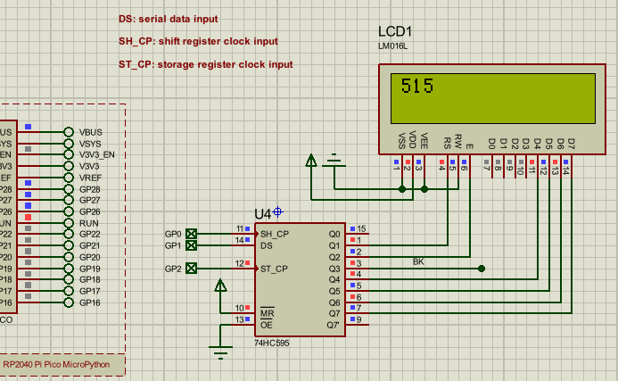
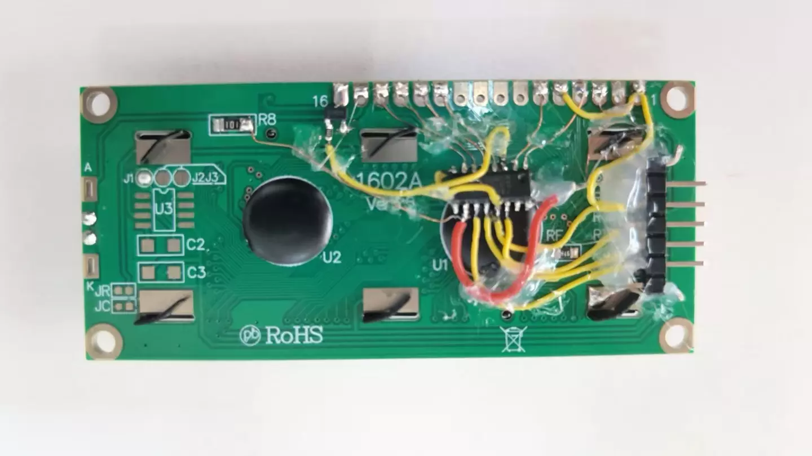

# LCD1602 595 drive 

Using 74hc595 to drive LCD1602, supporting SPI and GPIO modes, much faster than I2C.

Usage

```py
from machine import Pin, SoftSPI
from time import sleep_ms
from lcd1602_595 import LCD1602_595

#lcd = LCD1602_595(ST_CP=Pin(2), SH_CP=Pin(0), DS=Pin(1))
lcd = LCD1602_595(spi=SoftSPI(sck=Pin(0),mosi=Pin(1),miso=Pin(25)), ST_CP=Pin(2))

n = 0
while 1:
    lcd.print(f"{n}", end=' ')
    n += 1

    sleep_ms(200)
```

schematic and proteus simulator




image



