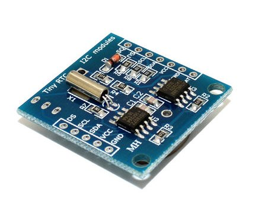

# AT24XX EEPROM

AT24/AT25 series electrically erasable PROM drive



## I2C Address

0x50 - 0x57

## API

* **write_byte(addr, dat)**  
write a byte to given address.  

* **read_byte(addr)**  
read a byte from given address.

* **write_word(addr, dat)**  
write a word to given address.  

* **read_word(addr)**  
read a word from given address.

* **write_dword(addr, dat)**  
write a dword (double word) to given address.  

* **read_dword(addr)**  
read a dword from given address.

* **write_buf(addr, dat)**  
write a buffer to given address, maximum buffer length is 32.  

* **read_buf(addr, num)**  
read a buffer from given address.

## example

```
from machine import I2C, Pin
import AT24XX

i2c = I2C(sda = Pin(5), scl=Pin(4))
ee = AT24XX.AT24XX(i2c)

ee.write_byte(0, 12)
ee.read_byte(0)

ee.write_word(4, 0x1234)
ee.read_word(4)

ee.write_buf(800, 'Hello!')
ee.read_buf(800, 8)
```

From microbit/micropython Chinese community.  
www.micropython.org.cn
