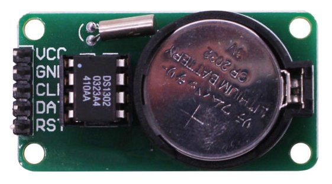

# DS1302

DS1302 is real-time clock (RTC) with serial interface, 31 * 8 data ram.




## API

* **start()**  
start RTC.  

* **stop()**  
stop/pause RTC

* **DateTime(DT = None)**  
get / set DateTime. If no paramter given, it will return current datetime, otherwise it will set datatime.  
datatime format: [Year, month, day, weekday, hour, minute, second]

* **Year(year = None)**  
get / set year.  

* **Month(month = None)**  
get / set month.  

* **Day(day = None)**  
get / set day.  

* **Weekday(weekday = None)**  
get / set month.  

* **Hour(hour = None)**  
get / set hour.  

* **Minute(minute = None)**  
get / set minute.  

* **Second(second = None)**  
get / set second.  

* **ram(reg, dat = None)**  
get / set ram data (31 bytes).  


## example

```
import DS1302
from machine import Pin

ds = DS1302.DS1302(clk=Pin(4), dio=Pin(5), cs=Pin(2))

ds.DateTime()
ds.DateTime([2018, 3, 22, 4, 23, 40, 1, 0])

ds.Hour()
ds.Second(10)
```

From microbit/micropython Chinese community.  
www.micropython.org.cn
