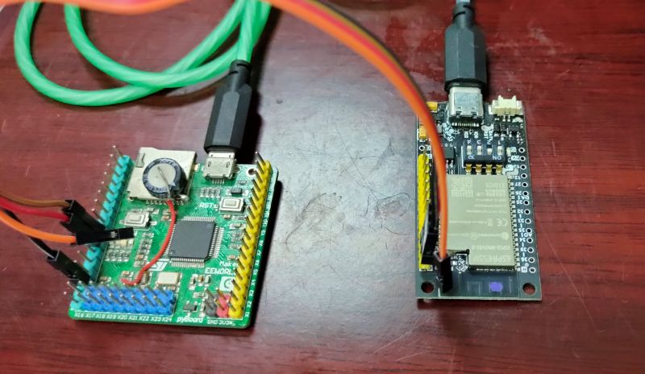

# irqUART

machine.UART is not support RXD irq feature, it will brings some difficulties to uart programming in some cases. 

irqUART give a alternative solutionuse, it use pin irq instead of uart irq. irqUART is simple, small and fast.

irqUART may wakeup mcu from sleep mode.




## Usage

1. define user RXD irq, frame irq (when needed).
2. define a uart object.
3. define irqUART object with uart, rxd pin, RXD irq, etc.
4. init uart.

## Parameters

* **uart**: uart object
* **rx_pin**: uart rxd pin
* **rx_irq**: user rxd irq, it can be None when not use rxd irq
* **frame_irq**: user frame irq. Frame irq will be trigger when no new data and exceeding the specified time. It can be None if not use it
* **CHR_TMO**: rxd irq delay (ms) after rx_pin irq, it depond on baudrate, rxbuf etc.
* **FRAME_TMO**: frame irq delay (ms) after last char

## Example

```
from machine import Pin, UART
from irqUART import irqUART

cnt = 0
def U1_RX_IRQ(t):
    global cnt
    n = 0
    while u1.any():
        d = u1.any()
        cnt+=d
        n+=1
        print('[', n, ']', cnt, d, u1.read(d))

def U1_RX_FRAME_IRQ(t):
    global cnt
    print('FRAME end')
    cnt = 0

u1=UART(1)
ui = irqUART(u1, Pin('B7'), U1_RX_IRQ, U1_RX_FRAME_IRQ)
ui.uart.init(115200)
```

## Note

If you use uart transmit mass data, you may need to increase uart rxbuf size to avoid data loss.

From microbit/micropython Chinese community.  
www.micropython.org.cn
