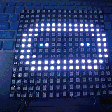

# ESP8266/ESP32 neopixel 16x16 iamge display drive

## API

* **set(n, color)**  
set LED[n] to color  
n: 0-255  
color: LED color. if color is not given, it will using default color  

* **clear()**  
clear all LED  

* **show(self, dat, offset=0)**  
show color emijo.  
dat:    color emijo data  
offset: display offset  

## example

see test.py  

**Please note neopixel display must using external power.**  

From microbit/micropython Chinese community  
www.micropython.org.cn