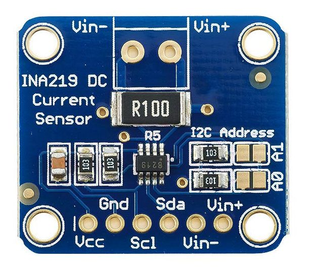

# INA219  

Zerø-Drift, Bidirectional Current/Power Monitor With I2C Interface.




## description

Calibration Register must be written in order to read the current value. Default Calibration Register value is 4096, which has a significant error and needs to be calibrated according to the actual circuit.


## uasge

```
from machine import Pin, SoftI2C
import ina219

# please modify scl/sda to the actual pins.
i2c = SoftI2C(scl=Pin(pins.pin_SCL), sda=Pin(pins.pin_SDA))

ina = ina219.INA219(i2c)
ina.calreg(3450)

v = ina.volt()
c = ina.current()
p = ina.power()

```

From microbit/micropython Chinese community.  
www.micropython.org.cn
