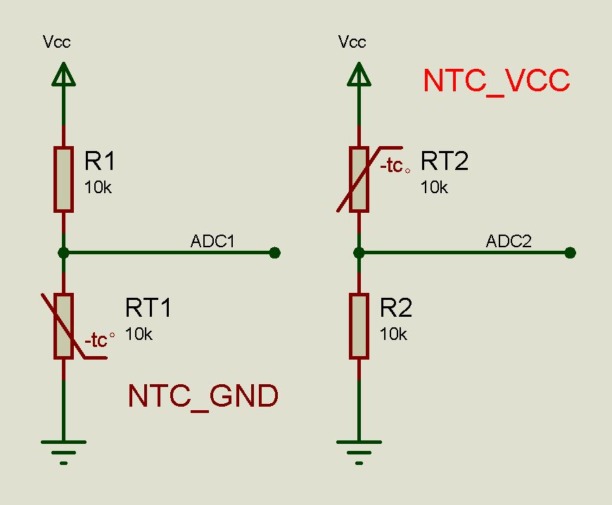

# NTC thermistor 

NTC thermistor Sensor.


There are two connection methods for NTC resistors: NTC connected to VCC or GND, as shown in the figure.




## description

- NTC_GND(adc, max, B=3780)
- NTC_VCC(adc, max, B=3780)

  Convert numerical values to Celsius temperature.
  
  - adc, NTC input value, it can be voltage or ADC value.
  - max, maximum value for ADC, it can be voltage (usually Vcc) or ADC value.
  - B, B value of NTC resistor.

If using esp32 series chips, use ADC.read_uv() to get ADC value for best optimal accuracy. 


## example

```python
from machine import ADC, Pin

ADC_T1 = ADC(Pin(34), atten=ADC.ATTN_11DB)
ADC_T2 = ADC(Pin(33), atten=ADC.ATTN_11DB)

T1 = NTC_VCC(ADC_T1.read_uv()/1000, 3300)
T2 = NTC_GND(ADC_T2.read_uv()/1000, 3300, B=3950)
```

From microbit/micropython Chinese community.  
www.micropython.org.cn