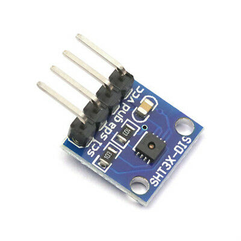

# [mpy-lib](https://github.com/micropython-Chinese-Community/mpy-lib)

## SHT3x 

Humidity and Temperature Sensor micropython driver, **16bit** I2C address mode.




## ESP32 example

```python
from machine import I2C, Pin
from time import sleep_ms
from sht3x_16bit import SHT3x

i2c = I2C(0, sda=Pin(21), scl = Pin(22))

sht30 = SHT3x(i2c)

while True:
    sht30.measure()
    print(sht30.ht())
    sleep_ms(1000)
```

## API

- SHT3x.**measure()**  
Starting measurement.

- SHT3x.**humidity()**  
get humidity.

- SHT3x.**temperature()**  
get temperature.

- SHT3x.**ht()**  
get humidity and temperature.

- SHT3x.**config(mode = 0x240b, delay = 6, decimal = 1)**  
  - mode, measurement command. Please see [mode table](#mode) below.
  - delay, measurement duration time
    - low repeatability, 4ms
    - Medium repeatability, 6ms (default)
    - High repeatability, 15ms 
  - decimal, number of digits after decimal point

- SHT3x.**heater(on=0)**  
Turn on/off internal heater.
  - on=1, turn internal heater
  - on=0, turn off internal heater

- SHT3x.**status()**  
Read **Status Register**

- SHT3x.**clear_status()**  
Clear **Status Register**

- SHT3x.**reset()**  
Soft Reset

<a name='mode'>mode table</a>
| mode | Repeatability | Measurement | mps |
|-|-|-|-|
| 0x2c06 | High | Single Shot| - |
| 0x2c0D | Medium | Single Shot | -|
| 0x2c10 |  Low | Single Shot | -|
| 0x2400 | High | Single Shot|- |
| 0x240b (default)| Medium | Single Shot |-|
| 0x2416 |  Low | Single Shot | -|
| 0x2032 | High | Periodic mode | 0.5|
| 0x2024 | Medium | Periodic mode | 0.5|
| 0x202F | Low | Periodic mode | 0.5|
| 0x2130 | High | Periodic mode | 1|
| 0x2126 | Medium | Periodic mode | 1|
| 0x212d | Low | Periodic mode | 1|
| 0x2236 | High | Periodic mode | 2|
| 0x2220 | Medium | Periodic mode | 2|
| 0x222b | Low | Periodic mode | 2|
| 0x2334 | High | Periodic mode | 4|
| 0x2322 | Medium | Periodic mode | 4|
| 0x2329 | Low | Periodic mode | 4|
| 0x2737 | High | Periodic mode | 10|
| 0x2721 | Medium | Periodic mode | 10|
| 0x272a | Low | Periodic mode | 10|  


please note, In order to simplify the code, crc8 checksum is ignored.

From [microbit/micropython Chinese community](https://www.micropython.org.cn).  
