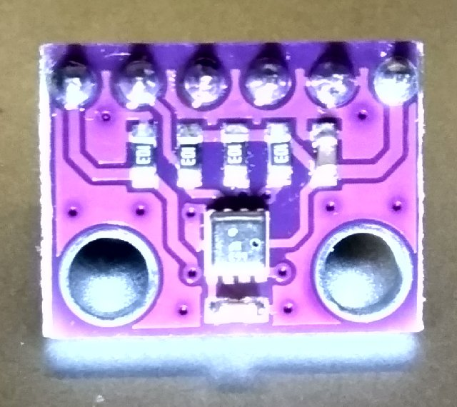

# BME280 Digital pressure sensor



## I2C Address

I2C Address depend SDO, defult address is:

**0x76**

When SDO is high address is:

**0x77**

## API

* **get()**  
get envirment temperature, pressure and humidity  

* **getTemp()**  
get envirment temperature 

* **getPress()**  
get Pressure

* **getHumi()**  
get Humidity

* **getAltitude()**  
Calculating absolute altitude

* **poweron()**  
goto normal mode

* **poweroff()**  
goto sleep mode

## example


```
from machine import I2C
import time

import bme280

b = bme280.BME280(I2C(1))

while True:
    time.sleep_ms(500)
    b.get()

```

From microbit/micropython Chinese community  
www.micropython.org.cn