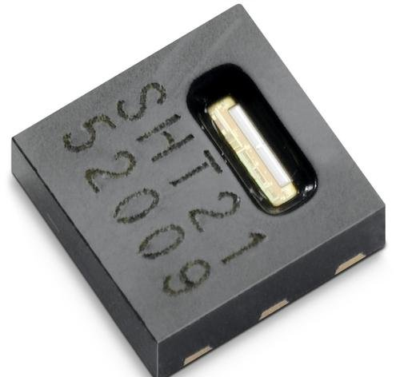

# SHT20 

Humidity and Temperature Sensor




## example

```python
from machine import I2C
import sht20

sht = sht20.SHT20(I2C(1))
print(sht.humi(sht.humi_raw()))

```

From microbit/micropython Chinese community.  
www.micropython.org.cn